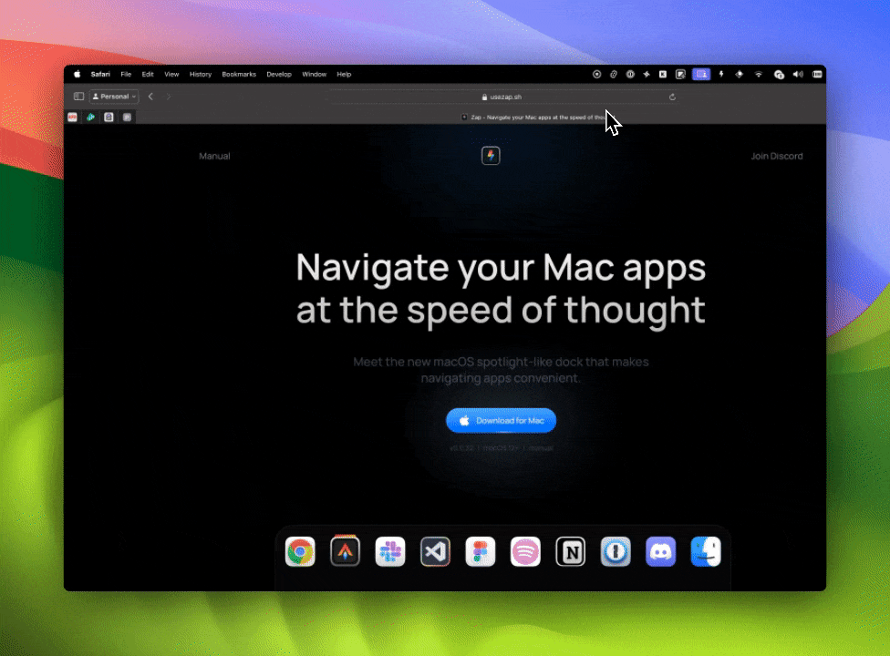

# Lofi Player

A macOS menu bar application for playing lofi music, built with Tauri + React + TypeScript.

This application demonstrates how to create a macOS menu bar app using Tauri with a clean, minimal interface that sits in your menu bar.

## Demo

See it in action:



## Prerequisites

- [Node.js](https://nodejs.org)
- [Tauri CLI](https://tauri.studio/docs/getting-started/installation)

## Getting Started

1. Install dependencies:
```
bun install
```

2. Run the development server:
```
bun tauri dev
```

3. Go to your menu bar and click the Tauri tray icon to open the lofi player.

## Building

To build the application for production:
```
bun tauri build
```

## Recommended IDE Setup

- [VS Code](https://code.visualstudio.com/) + [Tauri](https://marketplace.visualstudio.com/items?itemName=tauri-apps.tauri-vscode) + [rust-analyzer](https://marketplace.visualstudio.com/items?itemName=rust-lang.rust-analyzer)

## Tech Stack

- **Frontend:** React + TypeScript + Vite
- **Backend:** Rust + Tauri
- **UI:** CSS with menu bar optimized styling

## License

This project is licensed under the MIT License. See the [LICENSE](./LICENSE.md) file for details.